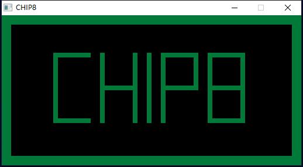

### CHIP-8 Emulator

What is CHIP-8 ? CHIP-8 is an interpreted programming language. CHIP-8 programs are run on a CHIP-8 virtual machine. It was made to allow video games to be more easily programmed for these computers. I wrote the emulator for practicing and fun.

### Build and run
It needs `SDL2` for GUIs. It has been tested on `Msys2` with `gcc 9` and `cmake`.

```bash
> cmake -G "MSYS Makefiles" .
> make
> ./chip.exe _ROM_FILE
```

### Screenshot

`c8pic` ROM:



### Resources

[CHIP-8 Technical Reference](http://devernay.free.fr/hacks/chip8/C8TECH10.HTM)

[Mastering CHIP-8 by Matthew Mikolay](http://mattmik.com/files/chip8/mastering/chip8.html)
